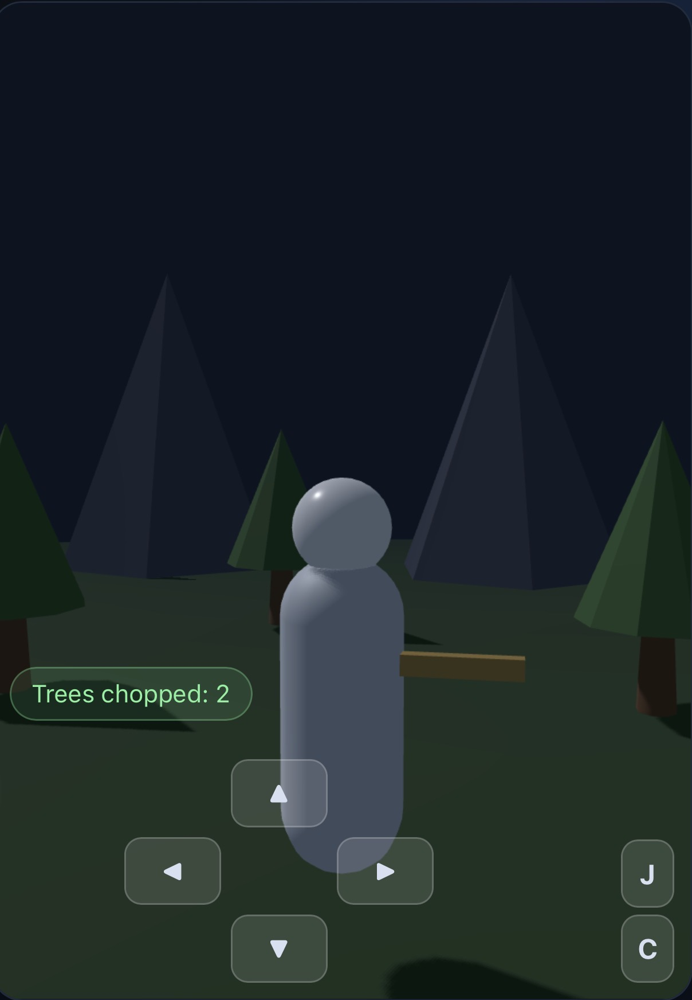

# chop-n-bike

Web-based 3D platformer game compatible with desktop and mobile clients



## Decription

This is a web-based 3D platformer game with procedural terrain that initially
looks like a forest. The initial world is bounded in a large circular-ish
surrounding of mountains, and the world exit is at one of the points in
that circle. There are plenty of trees, and walks to walk on.
The player can run, jump, turn, or strafe left to right.

The player initially looks like a stick figure, but we'll plan to expand
with selectable characters in a later development. The only view angle used is "over the shoulder view", similar to first-person but one can see the character's back.

The player also carries a sword that can chop down trees.

## Controls

This is a web game and can load in a browser. On deskop the controls would be WASD or the arrow keys for movement, the spacebar to jump, k, to swing the sword, and mouse controls to change the direction the player is facing. On mobile devices, use touch-screen controls similar to Minecraft Bedrock Edition: left side has a displayed touch-pad, right-side has two buttons to tap for jump or sword-strike. Touching in other areas of the screen can rotate the camera.

## Frameworks

This is based on Three.js with whatever additional overarching framework Three.js would be paired with, such as NextJS.

## Getting Started

```bash
npm install      # Install dependencies
npm run dev      # Start development server with hot reload
npm run build    # Production build
npm run start    # Start production server
npm run lint     # Run ESLint
```
